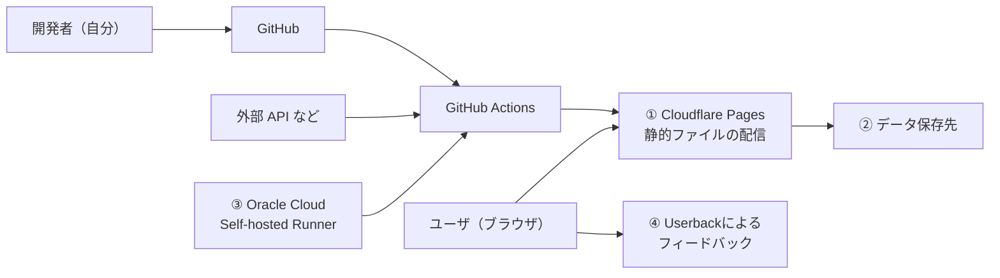

## はじめに

最近個人でNekometry / KurashiLabというサービスを作っています。  
サービスを世の中に公開するとなるとサーバーなどが必要になりますが、最近だと多くのものが無料枠で実現可能になっています。  
今回は、自分が開発からデプロイ、ホスティングまで無料でやっている範囲を整理がてら紹介していこうかなと思います。  
実際に触ってはいないが検討したものも含まれます。  

結論から書くと、今は次のような構成です。  
静的ファイルの配信を中心にして、必要になったものだけデータ保存先や周辺サービスを足しています。



この記事では、以下について書いていこうと思います。  

- （1）静的ファイルの配信
- （2）データ保存先
- （3）CI/CD と実行環境
- （4）Userback によるフィードバック


## （1）Cloudflare Pages で静的ファイルを配信する

基本的にSSG(Static Site Generation)でHTMLを生成し、それをホスティングする形にしています。  
これはSEOの観点からSSGにしておいたほうが有利らしいという理解から概ねこうしています。  
私がサービスを作る際は認証やデータの保持より先に、利用者へ価値を出せる部分があるはずだと考えており、そのため、Nekometry と KurashiLab では、認証やサーバー側のデータ保持を前提にしていません。
そうなるとデータの保存に関しては必要がなくなり、データを取得しjson等で持っておいてSSGの際に埋め込めばいいじゃんと判断でき、HTMLのホスティングだけを考えれば良くなります。  

結果として、SSG だけでほぼ問題なく動かせています。ユーザビリティのためにブラウザへデータを保存することはありますが、バックエンドは持たない構成です。  

ViteやVikeを使ったSSGについて以前記事を書いているので気になる方は見てみてください。  

https://zenn.dev/ara_ta3/articles/typescript-vike-ssg-getting-started

## （2）データ保存先について検討する

上の考え方なので、データ保存先はあまり使っていません。ただ、無料で始められる候補はいくつかあります。
実際保持したくなったらどうするか考えていたときに出てきた選択肢としていくつかあるのでそれらを紹介できればと思います。  

無料枠は変更されることがあるため、ここでは 2026 年 9 月時点の公式ページを参照しています。
初めに簡潔にまとめると以下のとおりです。  

|候補|容量|読み取り・書き込み|ネットワーク|
|---|---|---|---|
|Cloud Firestore|保存 1 GiB|読み取り 50,000 回/日<br>書き込み・削除 各 20,000 回/日|外向き転送 10 GiB/月|
|Cloudflare D1|保存 5 GB|読み取り 500 万行/日<br>書き込み 10 万行/日|D1 からのデータ転送は無料|
|Supabase|PostgreSQL 500 MB、Storage 1 GB|API リクエストは無制限|外向き転送 5 GB|

### Cloud Firestore

https://firebase.google.com/docs/firestore/pricing

現在、実際に使っているのは Cloud Firestore です。  
ブラウザから直接利用でき、サーバー側の処理が必要になったら Cloud Functions と組み合わせられます。  
元々Firebase Hostingを利用していて、認証のことも視野に入れていたので使ってみたものでした。  

かなり無料枠も一定あり、課金によってスケールしやすいので要件的には良いのですが、データアクセス権限の設定周りが結構複雑な印象です。  
なのでユーザの権限調整を細かくやりたくなる場合にはあまり使いたくないかなぁという感覚があります。  

### Cloudflare Workers + D1

https://developers.cloudflare.com/d1/platform/pricing/

RDBMS が必要なら、Cloudflare Workers と D1 も候補になります。
D1 は CloudflareにおけるマネージドSQLiteのデータベースです。

ブラウザから D1 へ直接アクセスするのではなく、Workers を API として挟みます。
バックエンドのDBとしてD1を利用するというイメージですかね。  
有料にしたとしても容量の限界があるらしく、増えていくデータの量によっては取らない方が良いかも知れませんが、初めに検証するには十分といえるでしょう。  

### Supabase

https://supabase.com/pricing

PostgreSQL を使いたい場合は Supabase も候補です。
Database だけでなく、Auth や Storage もまとめて使えます。  
よくあるフロントエンド、バックエンド、DBの構成を試したいならとりあえずSupabaseでよいだろうという感覚でいます。  

SupabaseやFirebaseと同様にローカルで触れられるエミュレーターが存在します。  
それらを触ってみて試すのも良いかもしれません。  
ローカルで触れるサンプルを以前書いたので気になる方は見てみてください。  

https://zenn.dev/ara_ta3/articles/typescript-supabase-getting-started

## （3）CI/CD として GitHub Actions を使い、Self-hosted Runner に Oracle Cloud を使う

### CI/CD: GitHub Actions + Oracle CloudのSelf-hosted Runner

GitHub Actions は、ビルドやテストだけでなく、外部 API からのデータ取得やデプロイにも使っています。  
Public Repository なら使いやすいですが、Private Repository では GitHub-hosted runner の無料枠に実行時間の制限があります。  

以下の URL の通り、GitHub Free では、Private Repository の GitHub-hosted Runner に月 2,000 分、Actions の成果物と GitHub Packages を合わせて 500 MB の無料枠があります。Public Repository の標準 GitHub-hosted Runner と Self-hosted Runner は無料です。

https://docs.github.com/en/billing/concepts/product-billing/github-actions

そこで Private Repository では、後述するOracle Cloud Always Free の VM を Self-hosted Runner として使っています。VM 上で GitHub Actions Runner を常駐させると、ジョブ実行時に GitHub から Runner へジョブが割り当てられます。

この構成なら GitHub-hosted runner の実行時間を消費せずに、CI/CD を動かせます。

#### Oracle Cloud を選んだ理由

以下の URL の通り、Oracle Cloud Infrastructure Free Tier には、期限のない Always Free の提供があります。Self-hosted Runner 用には、ARM ベースの OCI Ampere A1 Compute を使っています。

https://docs.oracle.com/iaas/Content/FreeTier/freetier.htm

公式ドキュメントでは、Always Free で利用を続ける ARM インスタンスは、テナンシー全体で合計 2 OCPU とメモリ 12 GB までと案内されています。
2 OCPUとメモリ 12GB？ デカくない？ ほんまか？ ってなるかもしれませんが、現実です。知ったとき私は騙されているのか？ と思いました。  

https://docs.oracle.com/en-us/iaas/Content/Compute/References/arm.htm

自分がこのインスタンスを作成しようとしたとき無料枠のままでは出来ませんでしたが、カードを登録して有料になっても払える状態になっていればインスタンス作成できたので、作れない方は参考にしてみてください。  
その後数ヶ月使っていますが請求はありません。  


### CD: Cloudflare Pages の Git 連携

Cloudflare Pages は GitHub リポジトリと連携すると、push を起点にビルドとデプロイを実行します。静的ファイルの配信では、これを CD として使っています。

以下の URL の通り、Cloudflare Pages のビルド環境には Go、Node.js、Bun、Python、Ruby が入っています。Node.js などは環境変数やバージョン指定ファイルで利用するバージョンを指定できます。

https://developers.cloudflare.com/pages/configuration/build-image/

以下の URL の通り、Cloudflare Pages Free の上限は、月 500 ビルド、同時実行 1 件、ビルド時間は 20 分です。

https://developers.cloudflare.com/pages/platform/limits/

Previewのビルドも回数に含まれてしまうため、が不要なら、Preview ブランチのデプロイを止めておくのがおすすめです。
ブランチへの push ごとにビルドされるため、不要なビルドを減らせます。

#### ビルド環境がない場合

TypeScriptのビルドは当然のように出来ますが、出来ない場合はwranglerなどを利用し、GitHub Actionsなどからデプロイする必要があります。  
KurashiLabというサービスでは ~~何を思ったのか~~ Scala.jsを使っているので、以下のような形でdistディレクトリにHTMLを生成してあるという前提で、wrangler pages deployをかけるようなデプロイフローを書いています。

```zsh
pnpm exec wrangler pages deploy path/to/dist --project-name=your-project-name
```

## （4）リッチな問い合わせフォームを SaaS で実現する: Userback

実際くるかわからないけど、何かユーザから問い合わせがあった際に気付けるようにはしておきたいなと思って問い合わせフォーム的なサービスないのかなと思っていました。  
そしたらちょうどよいものがありました。

https://userback.io/

Userback を使うと、自前でフォームとバックエンドを作らずに、問い合わせや不具合報告を受け付けられます。
以下の URL の通り、Free Forever では、2 プロジェクト・2 席まで、フィードバックを無制限に受け付けられます。
フィードバックの閲覧期間は 7 日間ですが、ウィジェット、ブラウザ拡張、スクリーンショットや動画を使ったフィードバック機能を利用できます。

https://userback.io/pricing/

Slack 連携もあり、受け取ったフィードバックを Slack のチャンネルへ通知できます。Slack 側で担当者の割り当てや解決もできるため、普段 Slack を見ているなら便利です。

https://support.userback.io/en/articles/5209235-connect-userback-with-slack


ちなみに右下に出ている「Feedback」というのをクリックしたときに出てくるフォームがUserbackです。  

- https://nekometry.com/
- https://kurashilab.app/

## 実際に動かしているもの

### Nekometry

https://nekometry.com/

- Cloudflare Pages
- Firestore
- GitHub Actions
- Oracle Cloud Self-hosted Runner
- Userback

### KurashiLab

https://kurashilab.app/

- Cloudflare Pages
- GitHub Actions
- Oracle Cloud Self-hosted Runner
- Userback
- 基本的にブラウザ内で処理と保存をして、バックエンドを持たない

## まとめ

SSGでCloudflare Pagesにホスティングし、永続化なども視野に入れた構構の話をしました。  
CI/CD周りはGitHub Actionsを使いつつSelf-hosted Runnerの話も触れました。  
これらは全て無料で出来るし、サーバセキュリティとか考えなくて良いなとなったので本当に良い世の中になったなと思います。
(Oracle CloudのInstanceはsshされないようにするとか一定のセキュリティ対策は自前で必要ですが。)
AIの登場によってなにかサービスを作ってみようとするハードルがまた一段と下がったと思うので、個人開発してみたいと思う人が増えたら良いなと思いますし、その際の参考になったら幸いです。  

