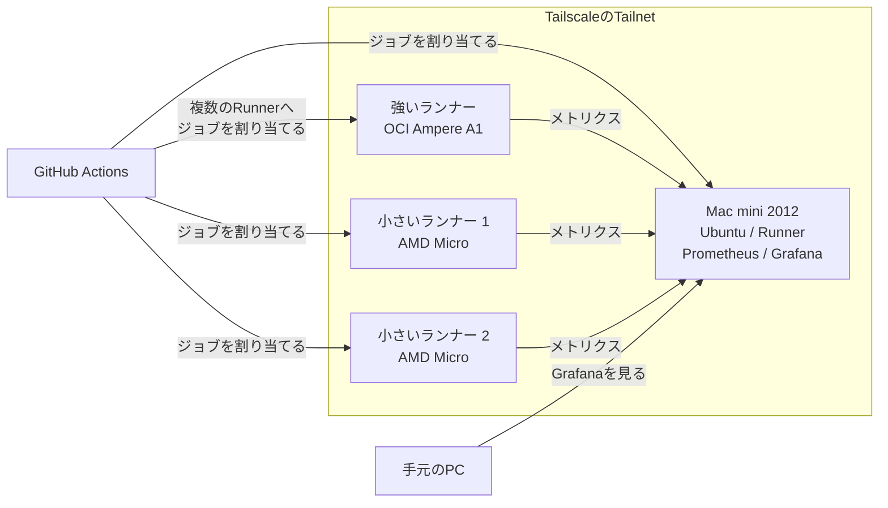
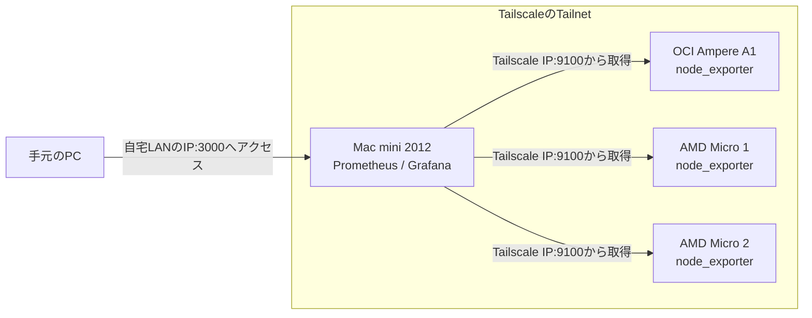

個人開発では、サービスそのものだけでなく、CIを動かす環境にも費用がかかります。できるだけ無料で個人開発を続けたかったので、Oracle CloudのAlways Freeで作ったインスタンスをGitHub ActionsのSelf-hosted Runnerとして使っています。

以前、ホスティングやデータ保存先も含め、無料で個人開発するときに使っているサービスを以下の記事へまとめました。

https://zenn.dev/ara_ta3/articles/develop-with-free-services

その中でもOracle CloudのSelf-hosted Runnerは、自分でインスタンスを管理する必要があります。今回は、Runnerの使い分け、ストレージの配分、監視と容量不足への対応について整理がてらまとめてみました。

しばらく動かしていると気になるのがディスク容量です。Dockerのイメージやビルド成果物が残ると、思ったよりもディスクを使います。SSHで各インスタンスへ入り、毎回`df`を見るのも面倒です。でも見ないと急にCIが止まります。

そこで、各インスタンスをTailscaleのTailnetへ参加させ、PrometheusとGrafanaでディスク容量を見られるようにしました。Grafanaはインターネットへ公開せず、自宅のネットワーク内からMac miniのIPアドレスを指定してアクセスします。

Oracle Cloudの各インスタンスではPublic IP宛てのInbound通信を許可せず、SSHでの接続やPrometheusからの収集にはTailscaleを使っています。

この記事は、Oracle Cloudの3台へ無料枠の200GBを配分し、自宅で動かしているMac mini 2012からディスク容量を監視している構成の備忘録です。

## 全体の構成

今は次のような構成にしています。



### 登場人物の整理

役割は以下のように分けています。

- Oracle Cloud
  - 強いインスタンス
    - 開発が活発で、ビルドやテストが重いRepositoryのRunnerを動かす
    - CPU数に合わせて複数のRunnerを動かす
    - node_exporterでCPU、メモリ、ディスクなどを公開する
  - 小さいインスタンス2台
    - Private Repositoryのうち、ビルドがさほど重くないもののRunnerを動かす
    - node_exporterでCPU、メモリ、ディスクなどを公開する
- 自宅
  - Mac mini 2012
    - Ubuntuを入れて常時起動する
    - PrometheusでOracle Cloudの各インスタンスからメトリクスを取得する
    - GrafanaでPrometheusのデータをグラフにする
    - GitHub ActionsのRunnerとしても使う
  - 手元のPC
    - 自宅LANからMac miniのGrafanaを見る
- Tailscale
  - Oracle Cloudの各インスタンスとMac miniを同じTailnetへ参加させる
  - Prometheusからnode_exporterへ接続するときに使う

PrometheusとGrafanaは、Oracle Cloudではなく自宅にあるMac mini 2012で動かしています。Mac miniにはUbuntuを入れており、監視サーバーだけでなくGitHub Actionsのランナーも同居させています。古いマシンですが、常時起動して監視と軽いジョブを動かす用途なら今のところ使えています。

## ランナー3台と200GBのストレージ

### 強いインスタンスと小さいインスタンス

Oracle CloudのAlways Freeでは、Armの`VM.Standard.A1.Flex`と、小さいAMDインスタンスの`VM.Standard.E2.1.Micro`を使えます。

この記事で「強い」「小さい」と呼んでいるインスタンスの違いは以下のとおりです。A1は割り当てを変更できるFlex Shapeですが、ここではAlways Freeの範囲で1台へまとめて割り当てた場合を載せています。

|呼び方|Shape|CPUアーキテクチャ|CPU|メモリ|主な使い方|
|---|---|---|---:|---:|---|
|強いインスタンス|VM.Standard.A1.Flex|Arm|2 OCPU|12GB|開発が活発で、ビルドやテストが重いRepository|
|小さいインスタンス|VM.Standard.E2.1.Micro|AMD|1/8 OCPU|1GB|ビルドがさほど重くないPrivate Repository|

OCPUはOracle CPUの略で、OCIでCPU性能を表す単位です。A1の場合、1 OCPUがArmプロセッサの1コアにあたります。

メモリだけでも12GBと1GBの差があります。E2.1.MicroのCPUは追加のCPUリソースを一時的に利用できるものの、基本は1/8 OCPUです。この差があるため、同じSelf-hosted Runnerでも担当するRepositoryを分けています。

### 無料で利用できるVolumeの200GBを3台へ配分する

以下の公式ドキュメントによると、Always Freeで使えるBlock Volumeはテナンシ全体で合計200GBです。この200GBには、追加したBlock Volumeだけでなく各インスタンスのBoot Volumeも含まれます。

https://docs.oracle.com/en-us/iaas/Content/FreeTier/freetier_topic-Always_Free_Resources.htm

今回は、3台に50GBずつBoot Volumeを割り当て、残りの50GBを強いランナーへ追加しています。

|インスタンス|用途|Boot Volume|追加のBlock Volume|合計|
|---|---|---:|---:|---:|
|OCI Ampere A1|主に使うランナー|50GB|50GB|100GB|
|AMD Micro 1|小さいランナー|50GB|-|50GB|
|AMD Micro 2|小さいランナー|50GB|-|50GB|
|合計||| |200GB|

追加の50GBは、DockerやGitHub Actionsの作業ディレクトリなど、増えやすいデータを置くために使っています。強いランナーへジョブが寄るので、3台へ均等に空き容量を残すよりも、この配分の方が今の使い方には合っていました。

### Dockerのデータを追加のBlock Volumeへ置く

強いインスタンスでは、Dockerのイメージなどのデータを追加したBlock Volumeの`/mnt/storage`側へ置いています。一部のRepositoryでは、GitHub Actionsのジョブに`container`を指定し、用意しておいたCI用イメージの中でテストを動かしています。実際の名前を伏せると、以下のような指定です。

```yaml
container:
  image: ghcr.io/your-name/your-project/ci:latest
```

CIに必要なツールや依存関係をDockerイメージ側へまとめられるため、Runner本体へ直接入れるものを減らせます。ディスク容量が増えたときも、Dockerのデータが原因ならDocker側を掃除すればよいという切り分けになります。

:::message
正直、小さいランナーを2台とも残す必要があるかは少し怪しいです。強いランナーしかほぼ使わない場合、小さい2台をなくし、A1へ50GBのBoot Volumeと150GBのBlock Volumeを割り当てる方が管理は楽だと思います。今は実験できる実行先を残したいので、3台構成にしています。
:::

### 開発のRepositoryごとにRunnerを使い分ける

ランナーの使い分けは、CPUアーキテクチャよりもRepositoryの開発頻度とビルド負荷で決めています。開発が活発でビルドも重いものは強いA1へ寄せ、Private Repositoryではあるものの、ビルドがさほど重くないものは小さいインスタンスへ流しています。

また、強いインスタンスにはGitHub ActionsのRunnerを1つだけではなく、割り当てたCPU数に合わせて複数用意しています。1つのRunnerが1つのジョブを実行していても、別のRunnerで次のジョブを受けられるようにするためです。

各RepositoryのWorkflowでは、使いたいインスタンスに付けたラベルを`runs-on`へ指定しています。同じ強いインスタンス上で動く複数のRunnerには同じラベルを付けているため、空いているRunnerがジョブを受け取ります。

強いインスタンスで同時に動かすRunnerを増やしすぎると、CPUやメモリを奪い合って逆に遅くなります。そのため、今はCPU数を目安にしています。

## Tailscaleで管理用のネットワークを作る

### Oracle CloudとMac miniをTailnetへ入れる

Grafanaの画面を確認するためだけに、Grafanaのポートをインターネットへ公開したくはありませんでした。そこで、Oracle Cloudの3台と自宅のMac miniへTailscaleを入れ、同じTailnetへ参加させています。

ちなみに、この記事を書いている途中で、Tailscaleの公式ドキュメントにもGrafanaとの組み合わせがあることを知りました。この構成を作った後で知ったものなので、構築時には参考にしていません。似た使い方を考えている方には役立ちそうです。

https://tailscale.com/docs/integrations/grafana

### Prometheusの収集とGrafanaへのアクセス

この状態にすると、Prometheusは各ランナーのTailscale IPまたはMagicDNS名を使ってnode_exporterへアクセスできます。一方、手元のPCからGrafanaを見るときはTailscale経由ではなく、自宅LANにあるMac miniのIPアドレスを指定しています。

Prometheusによるメトリクスの収集と、手元のPCからGrafanaへのアクセスを抜き出すと、以下のようになります。



Oracle Cloud側では、Public IP宛てのInbound通信を許可していません。node_exporterの9100番ポートにはTailscale経由で接続します。Mac miniで動かしているGrafanaの3000番ポートも、自宅LANの外からはアクセスできないようにしています。

Tailnetに参加できる端末も自分が管理するものだけにしています。台数が少ないうちは、VPNや証明書を自分で組むよりも設定が少なくて便利でした。

## PrometheusとGrafanaでディスク容量の監視を作る

### node_exporterをPrometheusへ登録する

各ランナーではnode_exporterを動かします。node_exporterはLinuxのハードウェアやOSに関するメトリクスを公開するExporterです。

https://prometheus.io/docs/guides/node-exporter/

Mac miniで動かしているPrometheusには、各ランナーのTailscale IPとnode_exporterのポートを収集先として設定しています。実際のIPアドレスとホスト名を伏せると、以下のような設定です。

```yaml
scrape_configs:
  - job_name: prometheus
    static_configs:
      - targets:
          - "localhost:9090"

  - job_name: "servers"
    static_configs:
      - targets:
          - "<mac-miniのTailscale IP>:9100"
        labels:
          host: "home-runner"

      - targets:
          - "<小さいインスタンス1のTailscale IP>:9100"
        labels:
          host: "oracle-small-1"

      - targets:
          - "<小さいインスタンス2のTailscale IP>:9100"
        labels:
          host: "oracle-small-2"

      - targets:
          - "<強いインスタンスのTailscale IP>:9100"
        labels:
          host: "oracle-primary"
```

Prometheus自身は`localhost:9090`、各ランナーは`servers`というジョブで収集しています。Tailscale経由で接続するため、Oracle Cloud上のPublic IPをPrometheusへ並べる必要はありません。`host`ラベルには、Grafana上で見分けやすい名前を付けています。

### Grafanaでディスクの空き容量を計算する

node_exporterからはCPUやメモリなどのメトリクスも取得できますが、今回Grafanaで見ているのはディスクの空き容量です。実際に使っているクエリは以下です。`node_filesystem_size_bytes`と`node_filesystem_avail_bytes`から、空き容量を割合で出しています。

```promql
100 * (
  node_filesystem_avail_bytes{
    job="servers",
    host!="",
    mountpoint=~"/|/mnt/storage"
  }
  /
  node_filesystem_size_bytes{
    job="servers",
    host!="",
    mountpoint=~"/|/mnt/storage"
  }
)
```

`/`は各インスタンスのBoot Volumeです。強いインスタンスへ追加したBlock Volumeは`/mnt/storage`へMountしているため、`mountpoint`ではこの2つだけを対象にしています。`host!=""`を付け、hostラベルが設定されている系列だけを表示します。

GitHub Actionsのジョブが失敗してから容量不足へ気づくよりも、どのランナーの空き容量が減っているかを一覧で見られる方が楽です。追加したBlock Volumeが意図したMount Pointで使われているかも確認できます。

### しきい値を下回ったらSlackへ通知する

Grafanaでは、上記のクエリで求めた空き容量の割合にしきい値を設定しています。空き容量がしきい値を下回ると、個人で使っているSlackワークスペースへAlertを送ります。Grafanaを毎日見に行かなくても、掃除が必要になったタイミングで気づけます。

### Slack通知を受けたらMakefileから掃除する

Slackへ通知が来たら、まず何がディスクを使っているか確認します。毎回コマンドを思い出すのも面倒なので、各インスタンスには以下のようなMakefileを置いています。

```makefile
dfdu:
	df -h
	docker system df
	sudo du -sh /opt/action-runners/*/_work

prune/docker:
	docker system prune -a

prune/work:
	sudo rm -rf /opt/action-runners/*/_work/*
```

まず`make dfdu`を実行し、ファイルシステム全体、Docker、GitHub Actions Runnerの作業ディレクトリがそれぞれどれくらい使っているかを確認します。Container上で動かしているジョブのイメージなど、Docker側が大きければ`make prune/docker`を使います。Runnerの`_work`が残っていれば`make prune/work`で雑に消すという運用です。

`docker system prune -a`は使われていないDockerイメージなどを削除し、`prune/work`はRunnerの作業ディレクトリを削除します。ジョブの実行中には使わず、削除後のジョブではイメージや依存関係の取得が再度必要になる前提で実行しています。

## まとめと感想

この構成にして、Oracle Cloudの無料枠をGitHub Actionsの実行環境として使いつつ、ディスク容量を1か所から確認できるようになりました。

特に良かったのは、Grafanaやnode_exporterをインターネットへ公開せずに済んだことです。PrometheusはTailscale経由でOracle Cloudから収集し、Grafanaは自宅LANからだけ見られるようにしています。自分用の管理画面を置く用途と相性が良いと感じています。

一方で、Oracle Cloudの3台とMac miniがあるので、OSやランナーの更新対象も増えます。小さいランナーを使っていない場合、無理に台数を増やさず、強いランナーへストレージとジョブを寄せる構成でも十分そうです。
近い未来1台になってそうな気がするなと思いつつ個人開発を続けていこうと思いました。
