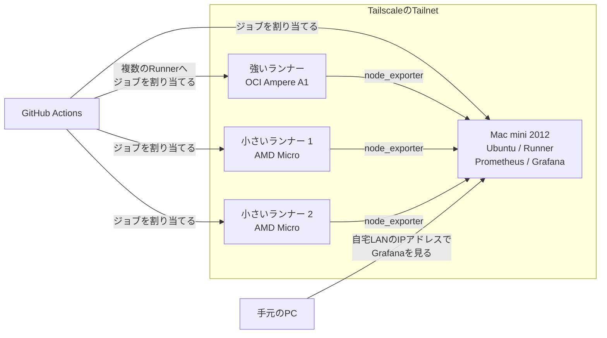

個人開発のCIでは、Oracle CloudのAlways Freeで作ったインスタンスをGitHub ActionsのSelf-hosted Runnerとして使っています。

しばらく動かしていると気になるのがディスク容量です。Dockerのイメージやビルド成果物が残ると、思ったよりもディスクを使います。SSHで各インスタンスへ入り、毎回`df`を見るのも面倒です。

そこで、各インスタンスをTailscaleのTailnetへ参加させ、PrometheusとGrafanaでディスク容量を見られるようにしました。Grafanaはインターネットへ公開せず、自宅のネットワーク内からMac miniのIPアドレスを指定してアクセスします。

この記事では、Oracle Cloudの3台をGitHub Actionsのランナーとして使いながら、無料枠に含まれる200GBを配分し、ディスク容量を監視している構成について書きます。監視には、自宅で動かしているMac mini 2012も使っています。細かなインストール手順よりも、何をどこへ置いたかを中心にした備忘録です。

## 全体の構成

今は次のような構成にしています。



役割は以下のように分けています。

- Oracle Cloud
  - 強いインスタンス
    - 開発が活発で、ビルドやテストが重いRepositoryのRunnerを動かす
    - CPU数に合わせて複数のRunnerを動かす
    - node_exporterでCPU、メモリ、ディスクなどを公開する
  - 小さいインスタンス2台
    - Private Repositoryのうち、ビルドがさほど重くないもののRunnerを動かす
    - node_exporterでCPU、メモリ、ディスクなどを公開する
- 自宅
  - Mac mini 2012
    - Ubuntuを入れて常時起動する
    - PrometheusでOracle Cloudの各インスタンスからメトリクスを取得する
    - GrafanaでPrometheusのデータをグラフにする
    - GitHub ActionsのRunnerとしても使う
  - 手元のPC
    - 自宅LANからMac miniのGrafanaを見る
- Tailscale
  - Oracle Cloudの各インスタンスとMac miniを同じTailnetへ参加させる
  - Prometheusからnode_exporterへ接続するときに使う

PrometheusとGrafanaは、Oracle Cloudではなく自宅にあるMac mini 2012で動かしています。Mac miniにはUbuntuを入れており、監視サーバーだけでなくGitHub Actionsのランナーも同居させています。古いマシンですが、常時起動して監視と軽いジョブを動かす用途なら今のところ使えています。

## ランナー3台と200GBのストレージ

Oracle CloudのAlways Freeでは、Armの`VM.Standard.A1.Flex`と、小さいAMDインスタンスの`VM.Standard.E2.1.Micro`を使えます。

この記事で「強い」「小さい」と呼んでいるインスタンスの違いは以下のとおりです。A1は割り当てを変更できるFlex Shapeですが、ここではAlways Freeの範囲で1台へまとめて割り当てた場合を載せています。

|呼び方|Shape|CPUアーキテクチャ|CPU|メモリ|主な使い方|
|---|---|---|---:|---:|---|
|強いインスタンス|VM.Standard.A1.Flex|Arm|2 OCPU|12GB|開発が活発で、ビルドやテストが重いRepository|
|小さいインスタンス|VM.Standard.E2.1.Micro|AMD|1/8 OCPU|1GB|ビルドがさほど重くないPrivate Repository|

メモリだけでも12GBと1GBの差があります。E2.1.MicroのCPUは追加のCPUリソースを一時的に利用できるものの、基本は1/8 OCPUです。この差があるため、同じSelf-hosted Runnerでも担当するRepositoryを分けています。

以下の公式ドキュメントによると、Always Freeで使えるBlock Volumeはテナンシ全体で合計200GBです。この200GBには、追加したBlock Volumeだけでなく各インスタンスのBoot Volumeも含まれます。

https://docs.oracle.com/en-us/iaas/Content/FreeTier/freetier_topic-Always_Free_Resources.htm

今回は、3台に50GBずつBoot Volumeを割り当て、残りの50GBを強いランナーへ追加しています。

|インスタンス|用途|Boot Volume|追加のBlock Volume|合計|
|---|---|---:|---:|---:|
|OCI Ampere A1|主に使うランナー|50GB|50GB|100GB|
|AMD Micro 1|小さいランナー|50GB|-|50GB|
|AMD Micro 2|小さいランナー|50GB|-|50GB|
|合計||| |200GB|

追加の50GBは、DockerやGitHub Actionsの作業ディレクトリなど、増えやすいデータを置くために使っています。強いランナーへジョブが寄るので、3台へ均等に空き容量を残すよりも、この配分の方が今の使い方には合っていました。

強いインスタンスでは、Dockerのイメージなどのデータを追加したBlock Volumeの`/mnt/storage`側へ置いています。一部のRepositoryでは、GitHub Actionsのジョブに`container`を指定し、用意しておいたCI用イメージの中でテストを動かしています。実際の名前を伏せると、以下のような指定です。

```yaml
container:
  image: ghcr.io/your-name/your-project/ci:latest
```

CIに必要なツールや依存関係をDockerイメージ側へまとめられるため、Runner本体へ直接入れるものを減らせます。ディスク容量が増えたときも、Dockerのデータが原因ならDocker側を掃除すればよいという切り分けになります。

:::message
正直、小さいランナーを2台とも残す必要があるかは少し怪しいです。強いランナーしかほぼ使わない場合、小さい2台をなくし、A1へ50GBのBoot Volumeと150GBのBlock Volumeを割り当てる方が管理は楽だと思います。今は実験できる実行先を残したいので、3台構成にしています。
:::

ランナーの使い分けは、CPUアーキテクチャよりもRepositoryの開発頻度とビルド負荷で決めています。開発が活発でビルドも重いものは強いA1へ寄せ、Private Repositoryではあるものの、ビルドがさほど重くないものは小さいインスタンスへ流しています。

また、強いインスタンスにはGitHub ActionsのRunnerを1つだけではなく、割り当てたCPU数に合わせて複数用意しています。1つのRunnerが1つのジョブを実行していても、別のRunnerで次のジョブを受けられるようにするためです。

各RepositoryのWorkflowでは、使いたいインスタンスに付けたラベルを`runs-on`へ指定しています。同じ強いインスタンス上で動く複数のRunnerには同じラベルを付けているため、空いているRunnerがジョブを受け取ります。

強いインスタンスで同時に動かすRunnerを増やしすぎると、CPUやメモリを奪い合って逆に遅くなります。そのため、今はCPU数を目安にしています。

## Tailscaleで管理用のネットワークを作る

Grafanaの画面を確認するためだけに、Grafanaのポートをインターネットへ公開したくはありませんでした。そこで、Oracle Cloudの3台と自宅のMac miniへTailscaleを入れ、同じTailnetへ参加させています。手元のPCにはTailscaleを入れていません。

Tailscaleの公式ドキュメントでも、GrafanaをTailnet内に置き、ダッシュボードをインターネットへ公開せずにアクセスする構成が紹介されています。

https://tailscale.com/kb/1523/grafana

この状態にすると、Prometheusは各ランナーのTailscale IPまたはMagicDNS名を使ってnode_exporterへアクセスできます。一方、手元のPCからGrafanaを見るときはTailscale経由ではなく、自宅LANにあるMac miniのIPアドレスを指定しています。

```text
http://192.168.x.x:3000
```

Oracle Cloud側では、node_exporterの9100番ポートをインターネットから到達できるようにはしていません。Mac miniで動かしているGrafanaの3000番ポートも、自宅LANの外からはアクセスできないようにしています。Tailscaleを入れただけで公開中のポートが閉じるわけではないので、Oracle CloudのSecurity List、ルーター、各OSのFirewallも合わせて確認します。

Tailnetに参加できる端末も自分が管理するものだけにしています。台数が少ないうちは、VPNや証明書を自分で組むよりも設定が少なくて便利でした。

## PrometheusとGrafanaでディスク容量を見る

各ランナーではnode_exporterを動かします。node_exporterはLinuxのハードウェアやOSに関するメトリクスを公開するExporterです。

https://prometheus.io/docs/guides/node-exporter/

Mac miniで動かしているPrometheusには、各ランナーのTailscale上の名前とnode_exporterのポートを収集先として設定しています。雰囲気としては以下のような設定です。

```yaml
scrape_configs:
  - job_name: oracle-cloud-runners
    static_configs:
      - targets:
          - runner-arm:9100
          - runner-micro-1:9100
          - runner-micro-2:9100
          - runner-mac-mini:9100
```

実際のホスト名は、Tailnetで使っている名前へ置き換えます。Tailscale経由で接続するため、Oracle Cloud上のPublic IPをPrometheusへ並べる必要はありません。

Grafanaでは、まず以下を見られるようにしました。

- ファイルシステムごとの使用量
- ファイルシステムごとの空き容量
- CPU使用率
- メモリ使用量
- インスタンスが応答しているか

実際にGrafanaで使っているクエリは以下です。node_exporterの`node_filesystem_size_bytes`と`node_filesystem_avail_bytes`から、ディスクの空き容量を割合で出しています。

```promql
100 * (
  node_filesystem_avail_bytes{
    job="servers",
    host!="",
    mountpoint=~"/|/mnt/storage"
  }
  /
  node_filesystem_size_bytes{
    job="servers",
    host!="",
    mountpoint=~"/|/mnt/storage"
  }
)
```

`/`は各インスタンスのBoot Volumeです。強いインスタンスへ追加したBlock Volumeは`/mnt/storage`へMountしているため、`mountpoint`ではこの2つだけを対象にしています。`host!=""`を付け、hostラベルが設定されている系列だけを表示します。

GitHub Actionsのジョブが失敗してから容量不足へ気づくよりも、どのランナーの空き容量が減っているかを一覧で見られる方が楽です。追加したBlock Volumeが意図したMount Pointで使われているかも確認できます。

空き容量が減っていたときに毎回コマンドを思い出すのも面倒なので、各インスタンスには以下のようなMakefileを置いています。

```makefile
dfdu:
	df -h
	docker system df
	sudo du -sh /opt/action-runners/*/_work

prune/docker:
	docker system prune -a

prune/work:
	sudo rm -rf /opt/action-runners/*/_work/*
```

まず`make dfdu`を実行し、ファイルシステム全体、Docker、GitHub Actions Runnerの作業ディレクトリがそれぞれどれくらい使っているかを確認します。Container上で動かしているジョブのイメージなど、Docker側が大きければ`make prune/docker`を使います。Runnerの`_work`が残っていれば`make prune/work`で雑に消すという運用です。

`docker system prune -a`は使われていないDockerイメージなどを削除し、`prune/work`はRunnerの作業ディレクトリを削除します。ジョブの実行中には使わず、削除後のジョブではイメージや依存関係の取得が再度必要になる前提で実行しています。

今のところはダッシュボードを見に行く運用ですが、空き容量が一定値を下回ったら通知する設定も足したいと思っています。監視画面を作っただけだと、見に行かなければ気づけないためです。

## 運用して思ったこと

この構成にして、Oracle Cloudの無料枠をGitHub Actionsの実行環境として使いつつ、ディスク容量を1か所から確認できるようになりました。

特に良かったのは、Grafanaやnode_exporterをインターネットへ公開せずに済んだことです。PrometheusはTailscale経由でOracle Cloudから収集し、Grafanaは自宅LANからだけ見られるようにしています。自分用の管理画面を置く用途と相性が良いと感じています。

一方で、Oracle Cloudの3台とMac miniがあるので、OSやランナーの更新対象も増えます。小さいランナーを使っていない場合、無理に台数を増やさず、強いランナーへストレージとジョブを寄せる構成でも十分そうです。

一旦は3台を残し、Grafanaで実際の使用量を見ながら判断します。感覚ではなく、どのランナーがどれくらい使われているかを確認してから減らせるのも、監視を入れた利点かなと思います。
